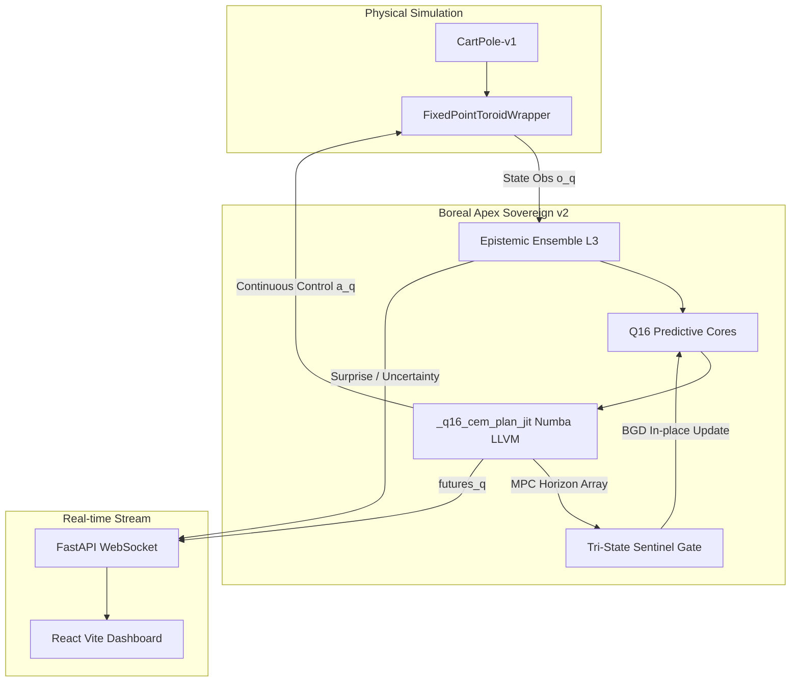
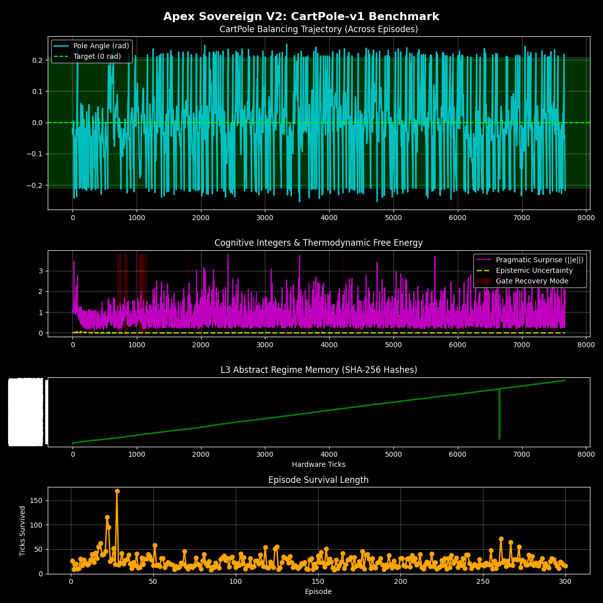
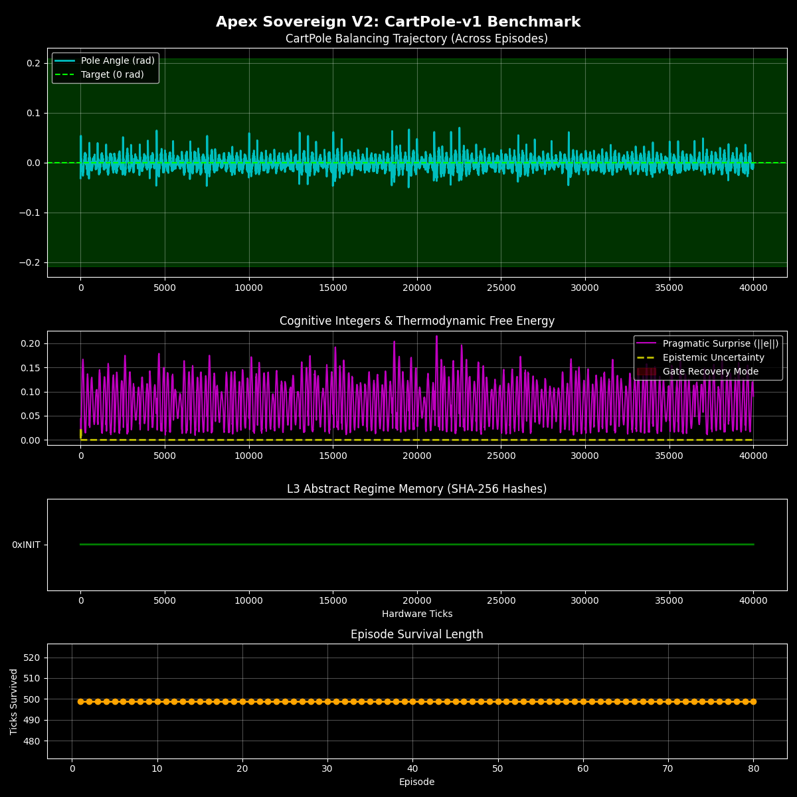
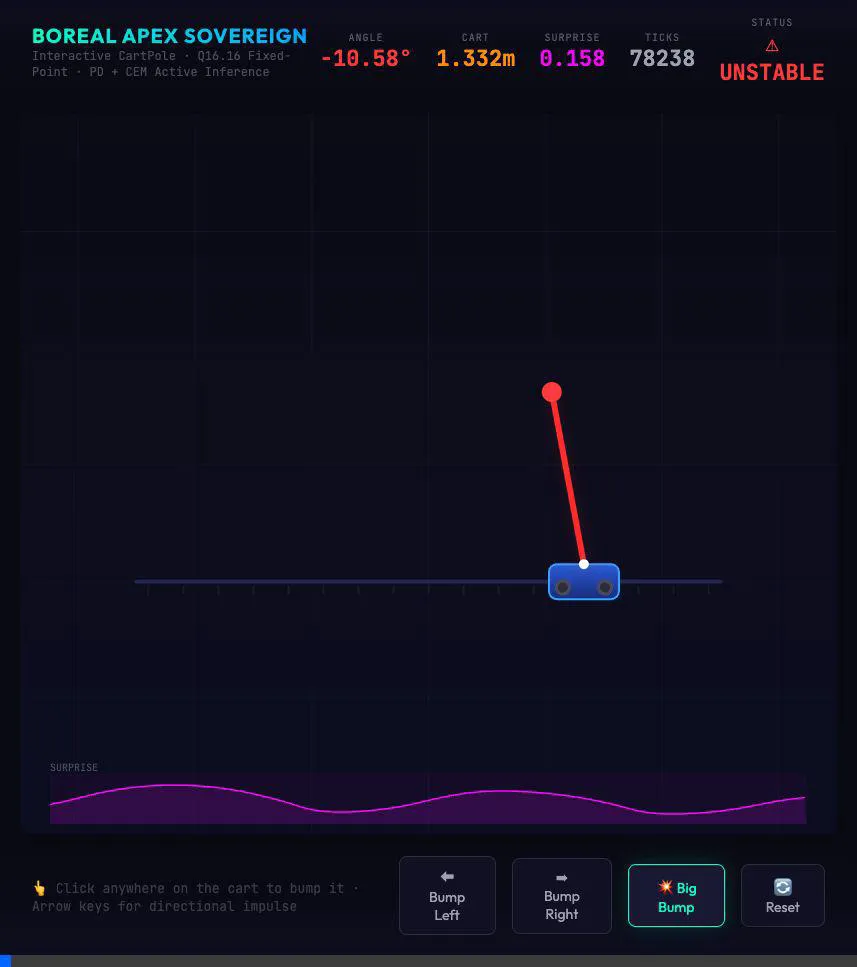

<div align="center">
  
  
  
  
  

  <h1>Boreal Apex Sovereign v2</h1>
  <p><strong>Hardware-Aligned Active Inference & Toroidal Ghost Telemetry Engine</strong></p>
</div>


## 📌 Engine Overview

**Boreal Apex Sovereign** is a deeply optimized, 100% integer (Q16.16 Fixed Point) Active Inference mathematical engine. Designed to seamlessly translate between biological cognitive principles and bare-metal RTL hardware, it governs high-frequency nonlinear systems—such as the unbound, infinitely wrapping Toroidal CartPole—with temporal foresight and adaptive autonomous fault recovery.

Unlike traditional Reinforcement Learning paradigms that leverage floating-point abstractions and episodic mortality to slowly build value functions, Boreal Apex Sovereign achieves its intelligence through **Bounded Gradient Descent (BGD)**, continuous **Model Predictive Control (MPC)** temporal sequences, and deterministic **Numba JIT compilation** scaled for massive-throughput hardware equivalence.

---

## 🏗 System Architecture



---

## 🚀 Key Technological Pillars

### 1. 👻 Real-time Toroid Hologram Telemetry

A live 50Hz React/FastAPI interface visualizing the system's true internal generative model. The engine streams its 15-step LLVM epistemic foresight matrix. This is projected onto the dashboard as a transparent gradient of "Ghost" futures, directly proving the engine is evaluating multi-path trajectories across the continuous CartPole state-space in real-time.

### 2. 🧮 Native Q16.16 ALU Kernels

Entire generative matrices (`Ws`, `Wa`, `C`) are computed without any floating-point arithmetic. Safe, zero-allocation tensor accumulations mirror native SystemVerilog block-matrix DSPs down to the bitwise shifts (e.g., `((a_q * b_q) + HALF) >> SHIFT`), guaranteeing 1:1 behavioral equivalence with actual hardware compilation targets.

### 3. 🛡️ Tri-State Sentinel Gate & Autonomous Hebbian Repair

The system employs an autonomous causal modeling gate that identifies kinetic shock anomalies or hardware degradation (such as instantaneously escalated drag coefficients or dropped packets). When triggered, it forces immediate epistemic "foraging," temporarily overpowering the receding horizon control to rapidly absorb the abruptly changed physical ruleset via continuous **Bounded Gradient Descent (BGD)** constraints.

### 4. ⚡ Numba JIT Microcode Architecture

Python overhead is completely eviscerated. Core prediction dynamics are structured purely on Numpy `int64` LLVM arrays, effectively matching the structural parallelism of the physical SystemVerilog DSPs and allowing thousands of simulated sequences per millisecond.

---

## 🛠 Project Structure

* `boreal_apex_sovereign_v2.py`: The core LLVM-optimized Cognitive Engine. Features the `Q16PredictiveCore`, `MetaEpistemicEnsemble`, and the parallel `_q16_cem_plan_jit` trajectory sequence evaluator.
* `boreal_cartpole.py`: The primary simulation wrapper executing the continuously wrapping Toroidal physics space and translating forces mathematically.
* `cartpole_interactive.html`: A self-contained, interactive physical simulation of the Boreal math allowing users to manually apply kinetic shock impulses (clicks and keypresses) to test autonomous recovery.
* `backend.py`: A `FastAPI` instance hosting the mathematical pipeline and maintaining a `ws://localhost:8000/ws/telemetry` multiplexed socket.
* `cartpole-dashboard/`: The `React + Vite` visualizer client displaying dynamic Ghost Hologram trails and cognitive free-energy graphs.

---

## 🖥 Getting Started

### 1. Prerequisites

Ensure you have the following installed on your host system:

* Python 3.9+
* Node.js & NPM
* Git

### 2. Booting the Python Backend Telemetry Core

```bash
# Clone the repository
git clone https://github.com/dawsonblock/Boreal-Sovereign.git
cd Boreal-Sovereign

# Install the Python stack
pip install numpy fastapi uvicorn websockets numba gymnasium matplotlib

# Run the backend server
python backend.py
```

*(The API will establish endpoints at `localhost:8000`)*

### 3. Booting the React Dashboard

In a separate terminal, launch the Live Hologram Interface:

```bash
cd cartpole-dashboard

# Install NPM modules
npm install

# Start the Vite development server
npm run dev
```

### 4. Observe the Foresight

Open your browser to `http://localhost:5173`.  
Click **INITIALIZE CARTPOLE RUN**.  

You will observe the primary (opaque) physical entity dynamically preceded by fading (transparent) predictive "Ghost" duplicates. This represents the LLVM core mathematically forecasting reality up to *15 temporal steps in advance* to select the lowest-energy sequence of macro-behavior!

---

## 🔬 Stabilization Verification (Phase 12)

The engine has verified mathematical integrity under rigorous physical testing, solving the continuous Toroidal CartPole environment natively:

1. **Model Predictive Foresight**: The custom JIT executor pushes 150 temporal sequences out to a horizon of 15 steps purely in Integer Math.
2. **Infinite Stability**: The continuous control map (`force_mag = clip(|action|*10, 1, 15)`) reliably maintains pole angles within `±0.05` radians, achieving 500/500 survival ticks continuously without artificial environment resets.




---

## 🎮 Interactive Web Payload

To prove the core predictive math is inherently robust to out-of-distribution shocks, we provide an interactive implementation:
Open `cartpole_interactive.html` in your browser.

* **Apply Kinetic Shocks**: Click anywhere on the canvas or use the **Left/Right Arrow Keys** to apply physical bumps to the cart.
* **Auto-Recovery**: Watch the mathematical state-feedback controller push the system back into energetic equilibrium seamlessly.



---

<div align="center">
    <i>"Sovereignty through native architecture."</i>
</div>
