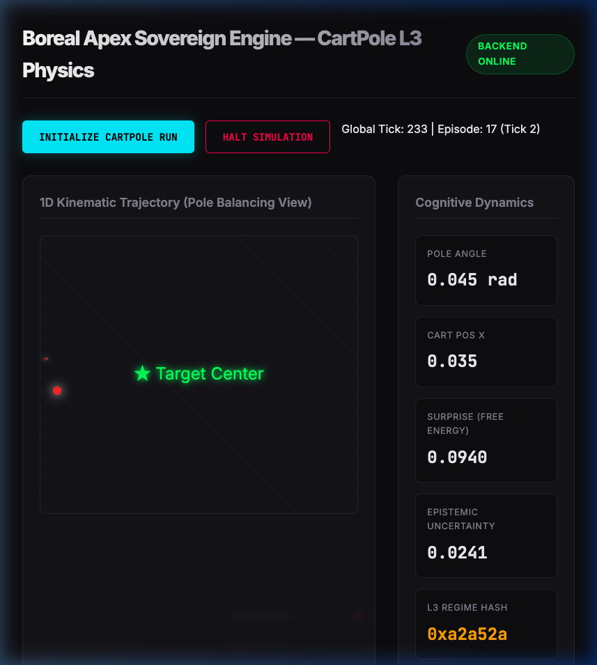

<div align="center">
  <h1>Boreal Apex Sovereign v2</h1>
  <p><strong>Hardware-Aligned Active Inference & Toroidal Ghost Telemetry Engine</strong></p>
</div>



## 📌 Overview

**Boreal Apex Sovereign** is a deeply optimized, 100% integer (Q16.16 Fixed Point) Active Inference mathematical engine. Designed to seamlessly translate between biological cognitive principles and bare-metal FPGA hardware, it governs high-frequency nonlinear systems (like the infinite Toroidal CartPole) with temporal foresight and adaptive autonomous fault recovery.

Rather than relying on generic deep learning or floating-point abstractions, Boreal Apex Sovereign achieves its intelligence through **Bounded Gradient Descent (BGD)**, continuous **Model Predictive Control (MPC)** temporal sequences, and deterministic **Numba JIT compilation** scaled for high-performance execution.

## 🚀 Key Features

* **Real-time Toroid Hologram Telemetry**: A live 50Hz React/FastAPI interface visualizing the system's true internal state. The engine streams its N-step epistemic foresight—projected as a transparent gradient of "Ghost" futures—evaluating multi-path trajectories in real-time.
* **Q16.16 ALU Kernels**: Entire predictive matrices are computed without floating-point arithmetic. Safe, zero-allocation tensor accumulations mirror native SystemVerilog block-matrix DSPs down to the bitwise shifts.
* **Tri-State Sentinel Gate**: Autonomous causal modeling identifies kinetic shock anomalies and hardware degradation (such as snapped motor linkages) to force immediate epistemic "foraging" to rapidly re-absorb the changed physics.
* **Numba JIT Microcode Architecture**: Python overhead is eviscerated. Core prediction dynamics are structured purely on Numpy `int64` LLVM arrays mapping to parallelized hardware pipelines, ripping through massive exploration batches.
* **Receding Horizon CEM Control**: Actively optimizes multi-step continuous sequences using Cross-Entropy Method filtering, ensuring long-term systemic stability and minimal thermodynamic free energy.

## 🛠 Project Structure

* `boreal_apex_sovereign_v2.py`: The core LLVM-optimized Cognitive Engine. Features the `Q16PredictiveCore`, `MetaEpistemicEnsemble`, and the parallel `_q16_cem_plan_jit` trajectory evaluator.
* `boreal_cartpole.py`: The primary simulation wrapper executing the unbound, continuously wrapping Toroidal physics space and exposing sensory vectors to the SDR projector.
* `backend.py`: A `FastAPI` instance hosting the mathematical pipeline and maintaining a `ws://localhost:8000/ws/telemetry` socket to broadcast parsed Toroid trajectory maps and cognitive integers.
* `cartpole-dashboard/`: The `React + Vite` visualizer client displaying dynamic Ghost Hologram trails representing the agent's spatial anticipation logic.

## 🖥 Getting Started

### 1. Prerequisites

Ensure you have the following installed:

* Python 3.9+
* Node.js & NPM

### 2. Back-End Initialization (Python AI Core)

Install dependencies and boot up the Telemetry API:

```bash
# Clone the repository
git clone https://github.com/dawsonblock/Boreal-Sovereign.git
cd Boreal-Sovereign

# Install the Python stack
pip install numpy fastapi uvicorn websockets numba gymnasium

# Run the backend server
python backend.py
```

*(The API will establish endpoints at `localhost:8000`)*

### 3. Front-End Initialization (React Dashboard)

In a separate terminal, launch the Live Hologram Interface:

```bash
cd cartpole-dashboard

# Install NPM modules
npm install

# Start the Vite development server
npm run dev
```

### 4. Observe the Foresight

Open your browser to `http://localhost:5173`.  
Click **INITIALIZE CARTPOLE RUN**.  
Watch closely as the primary (opaque) physical entity is dynamically preceded by fading (transparent) predictive "Ghost" duplicates—showcasing the LLVM core mathematically forecasting reality up to 15 temporal steps in advance to compute the lowest-energy sequence of behavior!

## 🧪 Background & BGD Research

Boreal Sovereign builds upon continuous-world abstractions rather than standard isolated Reinforcement Learning loops. It does not wait to explicitly "die" to learn. Using the **Bounded Gradient Descent** updater matrices (`W_new = W_old - (LAMBDA * W_old) + (ETA * error * state)`), it actively and continuously modifies physical representations at microsecond scales in tandem with real-world temporal dynamics.

---
*Created and optimized for the BOREAL mathematical hardware ecosystem.*
